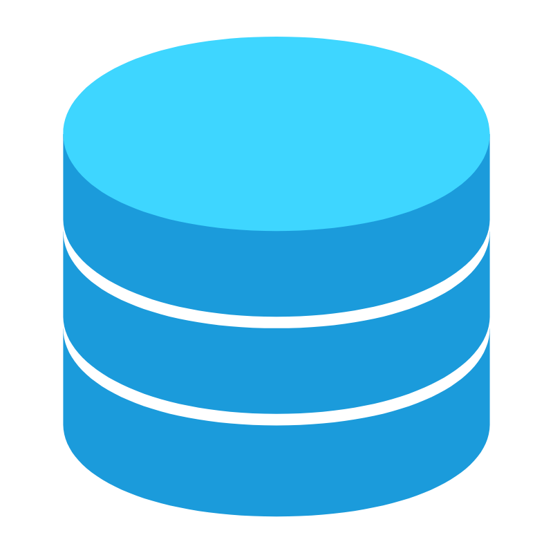

 

  

  <h3 align="center">Ambiente de dados</h3>

  

    Repositório de estudos.
     
   
    
  

## Sobre

Este repositório tem como objetivo armazenar os códigos desenvolvidos durante os estudos.
